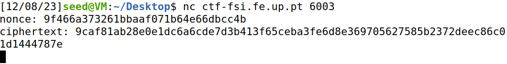
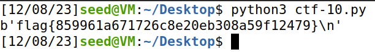

# CTF 10

## Weak Encryption

Assim que começamos a realização do CTF, a primeira coisa que fizemos foi analisar o ficheiro fornecido 'cipherspec.py'.

Inicialmete foram importados os módulos específicos 'Cipher, algorithms e modes' da biblioteca cryptography, usada para operações criptográficas.
Para além disso foi também definida a constante 'KEYLEN' como 16 bytes, que nos indica o comprimento da chave para a encriptação AES.

No ficheiro podemos observar 3 funções cuja finalidade é a seguinte:

### `gen()`
Trata-se de uma função que gera uma chave aleatória usada para encriptação e desencriptação de textos com comprimento definido em KEYLEN. Para o fazer, cria uma matriz de bytes preenchida com b'\x00' e acrescenta um offset número de bytes de dados aleatórios.

### `enc(k, m, nonce)`
Esta função recebe uma chave 'k', uma mensagem de texto simples 'm' e um 'nonce' para o modo de contador. Cria uma cifra com a chave e o nonce fornecidos e utiliza o encriptador da cifra para encriptar a mensagem 'm' e retorna o texto cifrado.

### `dec(k, c, nonce)`
Esta função recebe uma chave 'k', um texto cifrado 'c' e um 'nonce' para o modo de contador. De seguida, cria um cifra com a chave e o nonce fornecidos e utiliza o desencriptador da cifra para desencriptar o texto cifrado. No final, retorna o texto desencriptado.

### O que está de errado na forma como estes algoritmos estão a cifrar?

A vulnerabilidade que fomos capazes de detetar neste código está presente na função 'gen()'. Isto porque as funções geradas por esta função têm apenas um reduzido número de bytes a serem gerados de maneira aleatória. Isto aconte uma vez que é utilizado um offset com o valor fixo de 3 adicionado a bytes nulos para a criação da chave. Desta maneira a aleatoriedade da chave fica comprometida.

### Como consigo usar esta ciphersuite para cifrar e decifrar dados?

Para podermos cifrar e decifrar dados com base nesta ciphersuite primeiro devemos gerar uma chave aleatória usando a função gen() que já foi explicada acima. De seguida, para cifrar os dados devemos chamar a função enc(k, m, nonce), utilizando a chave gerada, a mensagem de texto e um valor nonce para obter o texto cifrado. Por fim, para decifrar a mensagem, apenas precisamos de chamar a função dec(k, c, nonce) utilizando os valores da chave gerada, do texto cifrado e o mesmo valor nonce utilizado na cifragem. Desta maneira, obtemos a novamente mensagem original.

### Como consigo fazer uso da vulnerabilidade que observei para quebrar o código?

Tal como referido acima, a vulnerabilidade que fomos capazes de detetar neste código está presente na função 'gen()' que compromete a aleatoriedade da chave. Assim, dada a falta de complexidade e variabilidade na geração da chave, é possível fazer uso desta vulnerabilidade, tentando exaustivamente todas as combinações possíveis em um ataque de 'brute force'.

### Como consigo automatizar este processo, para que o meu ataque saiba que encontrou a flag?

Para automatizar o processo apenas precisamos de criar um script que seja capaz de percorrer todas as combinações para os três bytes gerados de forma aleatória e assim encontrar a chave desejada. 

Inicialmente, para obter o valor do 'nonce' e da 'ciphertext', o que fizemos foi apenas conectarmo-nos ao servidor indicado no enunciado:


No final, o script que obtemos foi o seguinte:

```python
from cryptography.hazmat.backends import default_backend
from cryptography.hazmat.primitives.ciphers import Cipher, algorithms, modes
from binascii import unhexlify

KEYLEN = 16

def dec(k, c, n):
	cipher = Cipher(algorithms.AES(k), modes.CTR(n), backend=default_backend())
	decryptor = cipher.decryptor()
	msg = b""
	msg += decryptor.update(c)
	msg += decryptor.finalize()
	return msg

def find_flag():
    nonce = unhexlify("9f466a373261bbaaf071b64e66dbcc4b")
    ciphertext = unhexlify("9caf81ab28e0e1dc6a6cde7d3b413f65ceba3fe6d8e369705627585b2372deec86c01d1444787e")

    for i in range(256**3):
    	key = bytearray(b'\x00'*(KEYLEN-3)) 
    	key.extend(i.to_bytes(3, 'big'))
    	solution = dec(bytes(key), ciphertext, nonce)
    	if b'flag{' in solution:
            print(solution.decode())
            break

find_flag()
```


