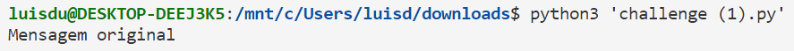

# CTF Semana #11 

## RSA

Começamos por analisar o script em python disponibilizado na plataforma CTF (`challenge.py`), onde temos:

- o método de conversão da flag em bytes para valor numérico

```python
def enc(x, e, n):
    int_x = int.from_bytes(x, "little")
    y = pow(int_x,e,n)
    return hexlify(y.to_bytes(256, 'little'))
```

- o algoritmo para decifração que faz o oposto

```python
def dec(y, d, n):
    int_y = int.from_bytes(unhexlify(y), "little")
    x = pow(int_y,d,n)
    return x.to_bytes(256, 'little')
```

Ao estabelecer ligação com o servidor CTF na porta 6004, obtemos como resposta os valores de `e`, `n` e `ciphertext`, isto é, do expoente da chave pública, do módulo e da flag cifrada utilizando RSA, respetivamente.


## Cálculo dos valores de p e q

Para conseguir obter a flag, é necessário calcular os valores dos primos. Assim, o primeiro passo foi implementar uma função que testa a primalidade de números. Por questões de eficiência, decidimos usar o algoritmo de Miller-Rabin: 

```py
def isPrime(n):
    if n != int(n):
        return False
    n = int(n)

    if n == 0 or n == 1 or n == 4 or n == 6 or n == 8 or n == 9:
        return False

    if n == 2 or n == 3 or n == 5 or n == 7:
        return True
    s = 0
    d = n - 1
    while d % 2 == 0:
        d >>= 1
        s += 1

    def trial_composite(a):
        if pow(a, d, n) == 1:
            return False
        for i in range(s):
            if pow(a, 2 ** i * d, n) == n - 1:
                return False
        return True

    for i in range(8):
        a = random.randrange(2, n)
        if trial_composite(a):
            return False

    return True
```

Sabendo que:

- p é um primo próximo de 2^512
- q é um primo próximo de 2^513
- p * q = n
 
 Conseguimos calcular os valores de `p` e `q` com a seguinte função:

```py
def getValues(n):
    i = 2**512-4999  #começar com um número ímpar  
    while (True):
        if n % i == 0 and is_prime(i):
            p = i
            q = n // p
            return p, q
        i+=2 #como o 2 é o único número par primo, podemos ignorar os números pares
```

Uma vez obtida os valores de `p` e `q`, resta apenas calcular o valor do expoente da chave privada `d`, onde:

```
ed % (p-1)(q-1) = 1
```

Decidimos utilizar o algoritmo de Euclides extendido para calcular `d`:

```py
def get_d(e, p, q):
    phi = (p - 1) * (q - 1)
    d = modinv(e, phi)
    return d

def modinv(a, m):
    gcd, x, y = egcd(a, m)
    if gcd == 1:
        return x % m

def egcd(a, b):
    if a == 0:
        return b, 0, 1
    else:
        gcd, x, y = egcd(b % a, a)
        return gcd, y - (b // a) * x, x
```

Por fim, apenas é necessário fazer o decode:

```
flag = dec(encoded_flag, d, n)
```

Ao executar o script, obtivemos a flag como o esperado:


---

### Como consigo usar a informação que tenho para inferir os valores usados no RSA que cifrou a flag?

Dado que é fornecido o valor de `n` (módulo), que corresponde ao produto de dois números primos `p` e `q` (n = pq), é possível fatorizar `n` para inferir os valores usados no RSA que cifrou a flag. De facto, esta fatorização é um problema difícil para números muito grandes, mas como tínhamos conhecimento prévio dos valores aproximados de `p` e `q`, bastou implementar implementar uma função que testa a primalidade de números, como é o caso do algoritmo de Miller-Rabin.

### Como consigo descobrir se a minha inferência está correta?

Para descobrir se os valores de `p` e `q` estão corretos, basta verificar se estes são primos e se `n` corresponde ao produto dos mesmos. No que diz respeito à chave privada `d`, pode-se verificar a sua corretude recorrendo às funções `def enc(x, e, n)`, `def dec(y, d, n)` e à chave pública `(e, n)`. Efetivamente, podemos encriptar uma mensagem com a chave pública, e decifrar a mesma com a chave privada calculada, verificando se obtemos a mensagem inicial:

```py
def main():
    n = 359538626972463181545861038157804946723595395788461314546860162315465351611001926265416954644815072042240227759742786715317579537628833244985694861278999587252099537054025239494322569387314306730633214178413315054444311999156077374322000597769335547551326153354168651568613515494246376025995607101292746067011
    e = 65537
   
    message = b"Mensagem original\n\n"
    ciphertext = enc(message, e, n)

    p, q = get_values(n)
    d = get_d(e, p, q)

    decoded = dec(ciphertext, d, n)
    new_message =decoded.decode()
    print(new_message)
```



### Finalmente, como posso extrair a minha chave do criptograma que recebi?

Para extrair a chave do criptograma, foi necessário:

- Calcular os valores de p e q
- Cálcular o valor de phi, onde phi = (p - 1) * (q - 1).
- Cálcular a chave privada d através da equação ed mod phi = 1, usando o algoritmo de Euclides extendido.