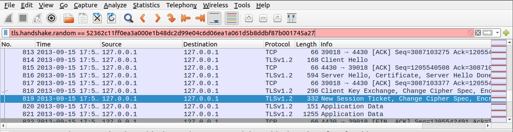
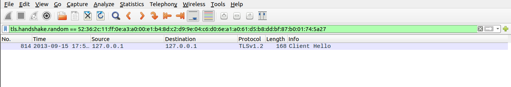
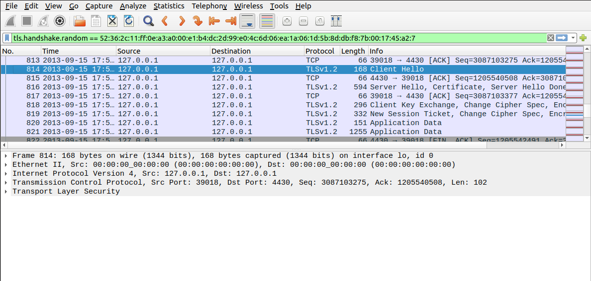
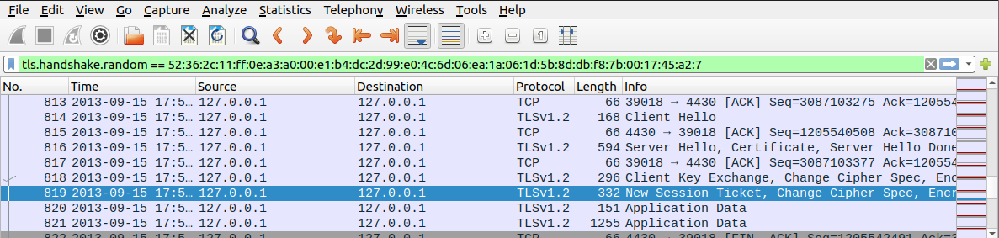
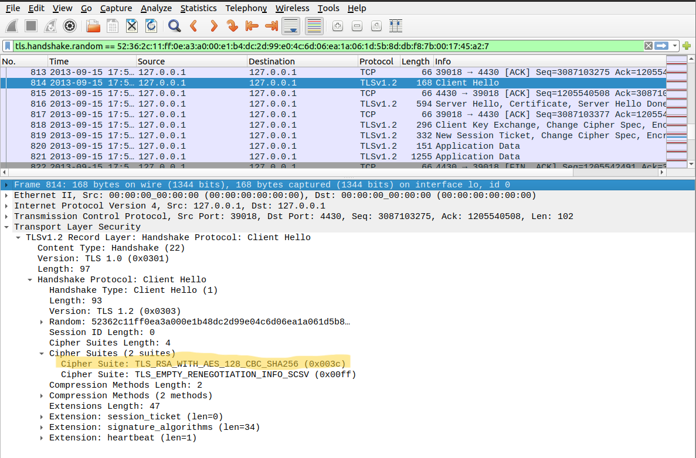
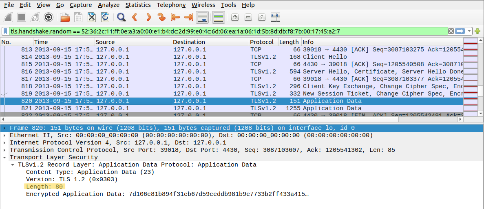
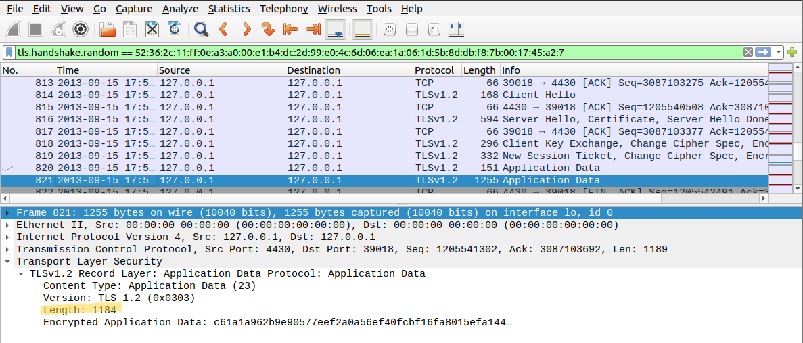
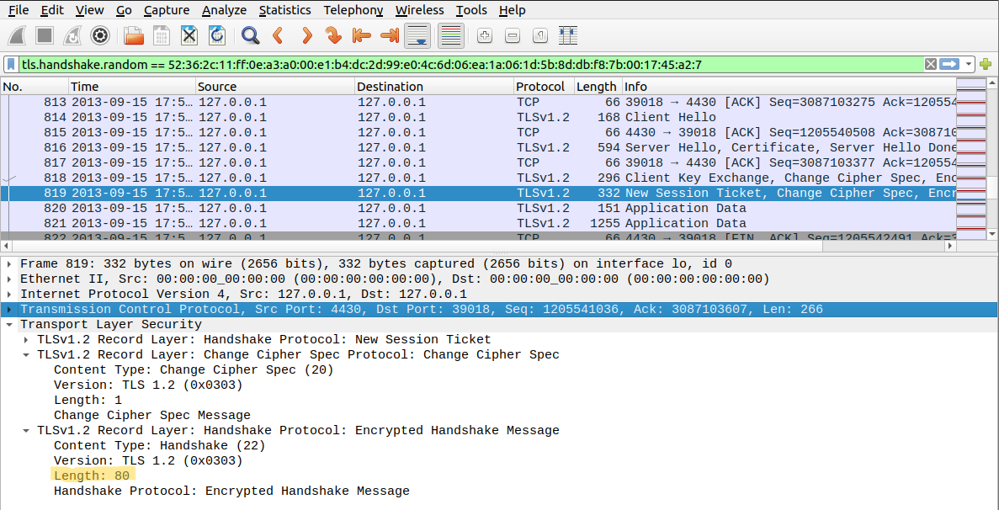

# CTF Semana #13

## Find-my-TLS

Começamos por utilizar o Wireshark para analisar o ficheiro dump.pcapng fornecido no desafio CTF. 

O objetivo era reconstruir a flag a partir dos detalhes de uma conexão TLS específica, focando-nos no handshake em que o número aleatório na mensagem de Client Hello era 52362c11ff0ea3a000e1b48dc2d99e04c6d06ea1a061d5b8ddbf87b001745a27. 

Assim, a primeira coisa que fizemos foi utilizar um filtro para encontrar o handshake TLS específico com o número aleatório mencionado. No campo de filtro, inserimos: 
tls.handshake.random == 52362c11ff0ea3a000e1b48dc2d99e04c6d06ea1a061d5b8ddbf87b001745a27 e contra as nossas expectativas o resultado não foi o esperado. 

O campo de filtro ficou destacado a vermelho indicando que não existia nenhuma correspondência para a pesquisa efetuada. Rapidamente apercebemo-nos que se tratava de um erro na estrutura da pesquisa e, ao alterar para:
tls.handshake.random == 52:36:2c:11:ff:0e:a3:a0:00:e1:b4:dc:2d:99:e0:4c:6d:06:ea:1a:06:1d:5b:8d:db:f8:7b:00:17:45:a2:7
obtivemos então o resultado esperado.

Tal como indicado no enunciado, a estrutura da flag é: flag{<frame_start>-<frame_end>-<selected_cipher_suite>-<total_encrypted_appdata_exchanged>-<size_of_encrypted_message>}.

Assim, resolvendo por partes:

### 1. <frame_start> e <frame_end>

Representam o primeiro e último número de frames do procedimento de handshake. Rapidamente conseguimos perceber que o primeiro número de frames do procedimento será **814**. 

Para além disso, compreendendo o funcionamento do protocolo TLS, sabemos que a conclusão do handshake ocorre quando o servidor transmite um New Session Ticket ao cliente. Assim,  o último número de frames do procedimento de handshake é **819**.

### 2. <selected_cipher_suite>

Trata-se do nome da ciphersuite escolhida. Para o descobrirmos, apenas tivemos de analisar a frame 814 e procurar o campo Cipher Suite. Assim descobrimos que se tratava do valor **TLS_RSA_WITH_AES_128_CBC_SHA256** 

### 3. <total_encrypted_appdata_exchanged> 
Corresponde à soma total do tamanho dos dados cifrados trocados. Assim, para obtermos este valor apenas precisamos de somar o número de bytes enviados por cada frame: 80 e 1184, obtendo assim **1264**

### 4. <size_of_encrypted_message> 
Representa o tamanho da mensagem cifrada que concluiu o procedimento de handshake. Como já sabemos que se trata da frame 819, apenas precisamos de observar o seu tamanho e obtivemos assim o valor **80**

## Conclusão

Desta maneira, juntando todas as partes temos como resultado a flag: **flag{814-819-TLS_RSA_WITH_AES_128_CBC_SHA256-1264-80}**

