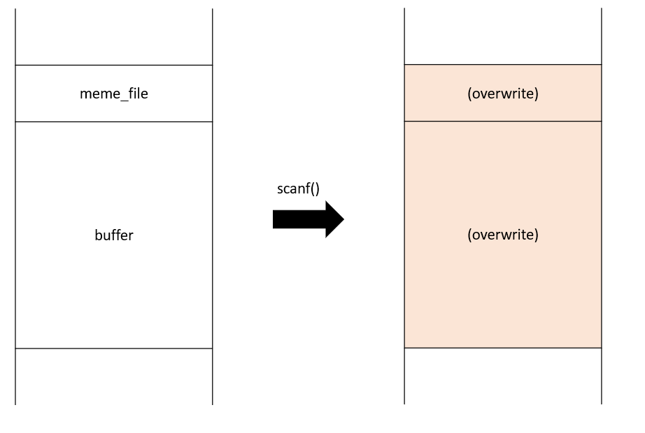
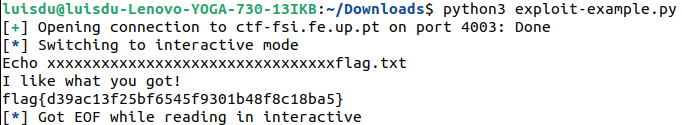
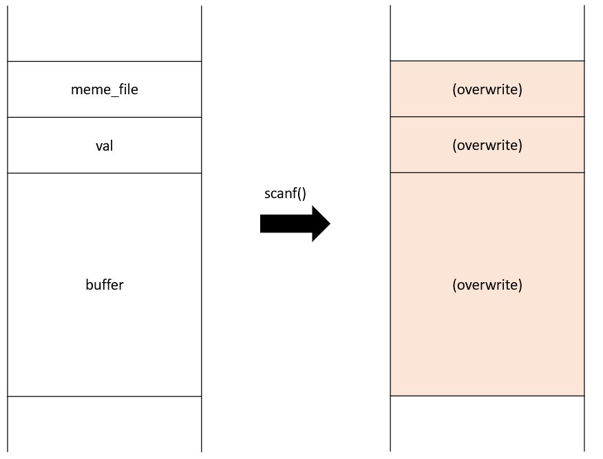
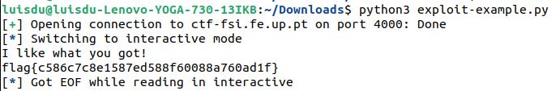

# CTF Semana #5 (Buffer Overflow)

## Desafio 1

### Recolha de informação

Começamos por analisar os ficheiros disponibilizados na plataforma CTF: um executável (`program`), o código fonte (`main.c`) e um script em python (`exploit-example.py`).

De seguida, corremos o comando `checksec program`, onde obtivemos o seguinte output:

```bash
Arch: i386-32-little
RELRO: No RELRO
Stack: No canary found
NX: NX disabled
PIE: No PIE (0x8048000)
RWX: Has RWX segments
```


Ao analisar apercebemo-nos que:
- a arquitetura do ficheiro é x86 (Arch)
- não existe um canário a proteger o return address (Stack)
- a stack tem permisssão de execução (NX)
- as posições do binário não estão randomizadas (PIE)
- existem regiões de memória com permissões de leitura, escrita e execução (RWX), neste caso referindo-se à stack

Assim sendo, concluimos que podemos explorar as vulnerabilidades associadas ao buffer overflow.

### Reconhecimento da vulnerabilidade

No `main.c`, verificamos que existem duas variáveis locais (`meme_file` e `buffer`), onde há alocação de 8 bytes e 32 bytes de memória, respetivamente:

```c
char meme_file[8] = "mem.txt\0";
char buffer[32];
```

No entanto, realiza-se posteriormente um `scanf`, que permite a cópia de 40 bytes para o buffer, que apresenta apenas 32 bytes. Deste modo, como o `scanf` não verifica os limites do buffer, pode ocorrer um buffer overflow.

Relembrando da estrutura da nossa stack, reparamos que:




Podemos dar overwrite não só ao conteúdo do `buffer`, mas também do `meme_file`. Como as instruções seguintes abrem 
e mostram o conteúdo do `meme_file`, podemos reescrever o nome do `meme_file` para que o ficheiro `flag.txt` seja aberto para leitura.

### Exploração da vulnerabilidade

No `exploit-example.py`, que interage com o serviço, mudamos a seguinte linha de código para que injetasse 32 caracteres seguidos de flag.txt:

```py
r.sendline(b"xxxxxxxxxxxxxxxxxxxxxxxxxxxxxxxxflag.txt")
```

Ao executar o script, verificamos que conseguimos ter acesso ao conteúdo do ficheiro `flag.txt`, nomeadamente à flag do desafio:





## Desafio 2

### Recolha de informação

O Desafio 2 é muito semelhante ao Desafio 1, pelo que também apresenta os mecanismos de segurança anteriormente referidos desativados, possibilitando ataques de buffer-overflow.

### Reconhecimento da vulnerabilidade

No `main.c`, verificamos que existem agora três variáveis locais (`meme_file`, `val` e `buffer`), onde há alocação de 9 bytes, 4 bytes e 32 bytes de memória, respetivamente:

```c
char meme_file[8] = "mem.txt\0";
char val[4] = "\xef\xbe\xad\xde";
char buffer[32];
```

No entanto, realiza-se posteriormente um `scanf`, que permite a cópia de 45 bytes para o buffer, que apresenta apenas 32 bytes. Deste modo, como o `scanf` não verifica os limites do buffer, pode ocorrer um buffer overflow.

Relembrando da estrutura da nossa stack, reparamos que:




Tal como no Desafio 1, queremos abrir e mostrar o conteúdo do ficheiro `flag.txt`, pelo que teremos de dar overwrite tanto ao valor de `meme_file` para `flag.txt`, bem como do `val` para `0xfefc2324` para que tal fosse possível.

### Exploração da vulnerabilidade

Reutilizamos o script python, desta vez injetando 32 caracteres seguido de `\x24\x23\xfc\xfe` e de `flag.txt`:

```py
r.sendline(b"xxxxxxxxxxxxxxxxxxxxxxxxxxxxxxxx\x24\x23\xfc\xfeflag.txt")
```

Ao executá-lo, obtivemos o seguinte output, onde tivemos acesso ao conteúdo do ficheiro `flag.txt`, nomeadamente à flag do desafio:



