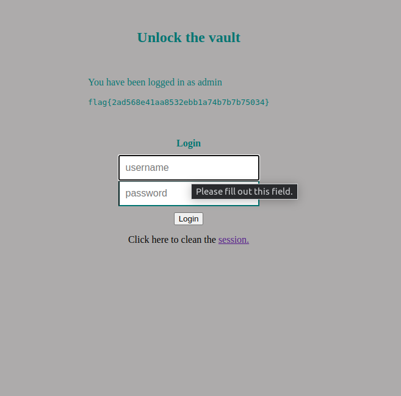

# CTF 8

## SQL Injection

Começamos por analisar o enunciado e o ficheiro fornecido, procurando vulnerabilidades que nos permitissem autenticar como administrador para obter a flag. Instantâneamente reparamos na seguinte linha:

```php
$query = "SELECT username FROM user WHERE username = '".$username."' AND password = '".$password."'";
```
Os user inputs não são sanitizados o que permite ao utilizador fazer um ataque do tipo SQL Injection e permitir a autenticação sem ser necessário uma password.

Posteriormente, inserimos a string "admin'--" no utilizador e iniciamos sessão com sucesso como admin e obtivemos a flag. Este string funciona uma vez que o ' define o fim da string e o -- inicia um comentário fazendo com que todo o código à frente nessa linha fosse inutilizado e a condição da password não precisasse de ser cumprida para a autenticação.
Na realidade, o código executado foi o seguinte:

```sql
SELECT username FROM user WHERE username = 'admin'
```
Com isto obtivemos a seguinte flag: 
`flag{2ad568e41aa8532ebb1a74b7b7b75034}`


