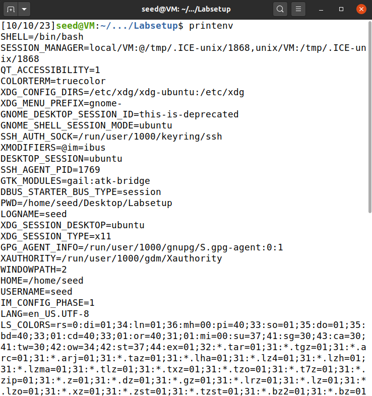
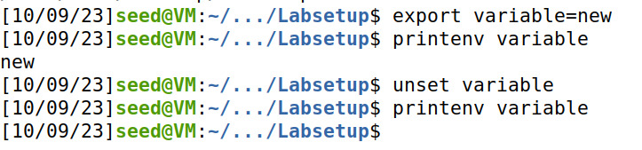

# Trabalho realizado na Semana #4

## 2.1 Task 1: Manipulating Environment Variables

In this task, we're using Bash in a seed account to learn about managing environment variables. Environment variables store information for Unix-based system processes. The primary goal is to **understand how to manipulate these variables** with Bash commands.

To begin, we can use commands like **printenv** or **env** to view all current environment variables. Additionally, we can display specific ones, such as the current working directory (PWD), using commands like **printenv PWD**.
<table>
  <tr>
    <td></td>
    <td></td>
  </tr>
</table>

The second part of this task involves using the export and unset commands to modify environment variables.
- **export** is used to set or create new environment variables.
- **unset** is used to remove or unset an environment variable, effectively deleting it from the environment.

## 2.2 Task 2: Passing Environment Variables from Parent Process to Child Process

In this task, we investigate how child processes inherit environment variables from their parent in Unix operating systems (using fork() system call). 

When fork() is invoked in Unix, it creates a new process by duplicating the parent process. The child process is nearly identical to the parent, but not all attributes are inherited.

The task aims to determine whether environment variables of the parent process are inherited by the child process when fork() is used.

