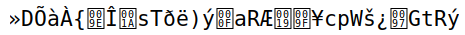
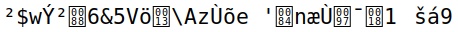
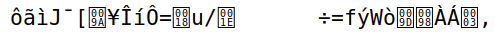

# Trabalho realizado na Semana #10

## Task 1: Frequency Analysis

A nossa primeira tarefa foi decifrar uma mensagem criptografada usando uma cifra monoalfabética. Tal como diz no enunciado, este tipo de cifra é vulnerável a uma técnica chamada de 'frequency analysis', sendo por isso a técnica que nos é pedida para realizar neste exercício.

Esta análise consiste em contar a ocorrência de cada letra do texto cifrado e compará-las com as diferentes frequências com que certas letras ou combinações aparcem em qualquer porção de texto do idioma do texto original (neste caso: inglês).

Numa fase inicial fomos tentando de diveras formas substituir as letras de modo a obtermos o resultado esperado. Para isso procuramos tabelas com as combinações de caracteres mais comuns para conseguirmos compreender quais as substituições mais provaveis de funcionar.

Essas combinações foram comparadas com as combinações mais prováveis baseando-nos no ficheiro 'freq.py' que nos foi fornecido.

No final, o resultado obtido foi o seguinte (a troca de letras foi feita por partes na mesma ordem que a versão final):

```bash
$ tr 'ytnvupmxqahbrizdlcgesfkowj' 'THEANDIOSCRFGLUYWMBPKVXJZQ' < ciphertext.txt > out.txt

```

Após a descodificação obtivemos o texto contido no ficheiro [out.txt](textfiles/logbook10_out.txt).

## Task 2: Encryption using Different Ciphers and Modes

Nesta tarefa, o objetivo é explorar vários algoritmos e modos de criptografia no ficheiro 'ciphertype'. Para isso, utlizamos as três opções que nos foram fornecidas no guião de trabalho. 

<table>
    <tr>
        <th>'-aes-128-cbc'</th>
        <th></th>
    </tr>
    <tr>
        <th>'-bf-cbc'</th>
        <th></th>
    </tr>
    <tr>
        <th>'-aes-128-cfb'</th>
        <th></th>
    </tr>
</table>
    
## Task 3: Encryption Mode – ECB vs. CBC
