# Trabalho realizado na Semana #11

## Lab Setup

### Container Setup

Para começar, fizemos download do ficheiro `Labsetup.zip` disponibilizado na página `https://seedsecuritylabs.org/Labs_20.04/Files/Crypto_PKI`. De seguida, inicializamos um container no diretório `Labsetup`:

```bash
$ docker-compose build
$ docker-compose up
```

Este container será utilizado para dar host ao servidor web.

### DNS setup

Adicionamos novas entradas nos hosts conhecidos pela máquina virtuais:

```bash
nano /etc/hosts     # adicionar '10.9.0.80 www.bank32.com'
```

## Task 1: Becoming a Certificate Authority (CA)

Um Certificado de Autoridade (CA) é uma entidade confiável que emite certificados digitais. O certificado digital certifica a propriedade de uma chave pública pelo sujeito nomeado no certificado. Nesta tarefa, criamos o nosso próprio CA, e geramos um certificado para o mesmo.

Copiamos o ficheiro de certificado default (presente em `/usr/lib/ssl/openssl.cnf`) para o diretório atual. Posteriormente, comentamos a linha `unique_subject` para que a criação de certificados com o mesmo subjeto fosse possível, e criamos os ficheiros necessários para que a configuração funcionasse:

```bash
mkdir myCA && cd ./myCA
mkdir certs crl newcerts
touch index.txt
echo "1000" >> serial
```

Geramos o CA com o seguinte comando:

```bash
openssl req -x509 -newkey rsa:4096 -sha256 -days 3650 \
-keyout ca.key -out ca.crt
```

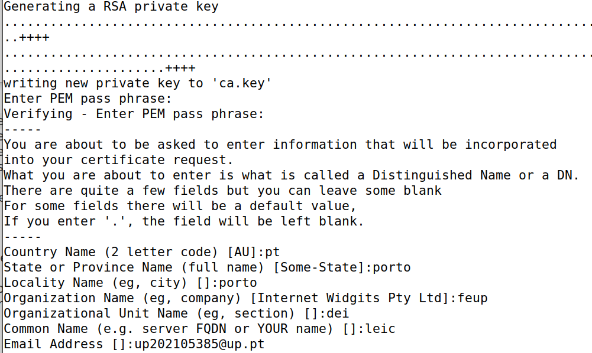

Os dados que inserimos foram os seguintes:
- passphrase (2000)
- nome do país (pt)
- região (porto)
- cidade (porto)
- organização (feup)
- secção (dei)
- nome (leic)
- email (up202105385@up.pt)

Verificamos que foram criados dois ficheiros novos - `ca.key`, que contém a chave privada, e `ca.crt`, que contém a chave pública:

```bash
openssl x509 -in ca.crt -text -noout
openssl rsa -in ca.key -text -noout
```

**(1)** Conseguimos concluir que se trata de um certificado CA pelo que apresenta o atributo `certificate authority` verdadeiro:

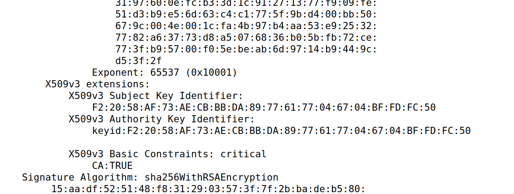


**(2)** O certificado é `self-signed` porque os campo `issuer` e o `subject` são iguais:

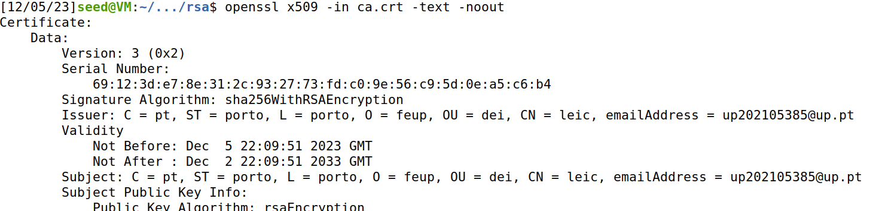


**(3)** Podemos identificar os elementos referentes à criptografia ([ficheiro completo](../screenshots/logbook11/task1.3.txt)), nomeadamente:
- os dois números primos (`prime1` e `prime2`);
- o `modulus`;
- os expoentes públicos e privados (`publicExponent` e `privateExponent`);
- o `coeficient`;


## Task 2: Generating a Certificate Request for Your Web Server

Para gerar o CSR (Certificate Signing Request), que inclui a chave pública do site que queremos (neste caso, `bank32.com`), executamos o seguinte comando, com dois nomes alternativos (`bank32A` e `bank32B`):

```bash
openssl req -newkey rsa:2048 -sha256 -keyout server.key -out server.csr -subj "/CN=www.bank32.com/O=Bank32 Inc./C=US"  passout pass:1234 -addext "subjectAltName = DNS:www.bank32.com, DNS:www.bank32A.com, DNS:www.bank32A.com"
```

Como output, obtivemos os ficheiros `server.csr` e `server.key`:

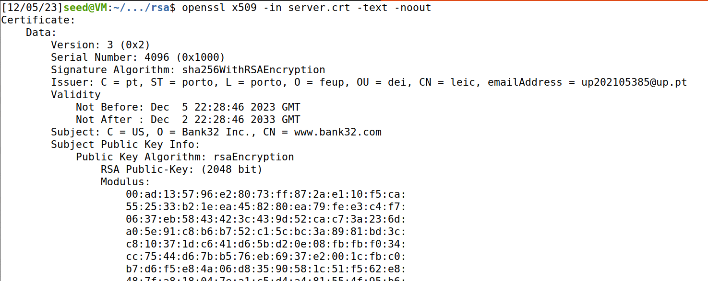


## Task 3: Generating a Certificate for your server

De modo a gerar um certificado para o servidor `www.bank32.com`, fizemos:

```bash
openssl ca -config myCA_openssl.cnf -policy policy_anything \
-md sha256 -days 3650 \
-in server.csr -out server.crt -batch \
-cert ca.crt -keyfile ca.key
```

Com isto obtivemos o `server.crt`, cujo conteúdo  permite confirmar que se trata de um certificado para o servidor supracitado.

Por razões de segurança, a configuração padrão no openssl.cnf não permite que o comando "openssl ca" copie o campo de extensão do pedido para o certificado final. Para habilitar isso, podemos acessar nossa cópia do arquivo de configuração e descomentar a seguinte linha:

```
copy_extensions = copy
```

Por fim, verificamos que os certificado abrange todos os nomes colocados:

```
openssl x509 -in server.crt -text -noout
 ```

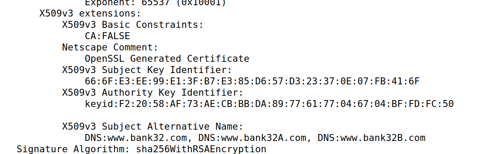

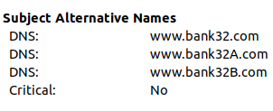


## Task 4: Deploying Certificate in an Apache-Based HTTPS Website

Nesta tarefa, analisamos como os certificados de chave pública são usados pelos sites para garantir a segurança na navegação web. 

Começamos por configurar um site HTTPS baseado no Apache. No nosso container, temos o seguinte ficheiro `/etc/apache2/bank32 apache ssl.conf` :

```xml
<VirtualHost *:443>
    DocumentRoot /var/www/bank32
    ServerName www.bank32.com
    ServerAlias www.bank32A.com
    ServerAlias www.bank32B.com
    DirectoryIndex index.html
    SSLEngine On
    SSLCertificateFile /certs/bank32.crt ➀
    SSLCertificateKeyFile /certs/bank32.key ➁
</VirtualHost>
```

Alteramos o ficheiro para usar o nosso servidor `www.bank32.com`:

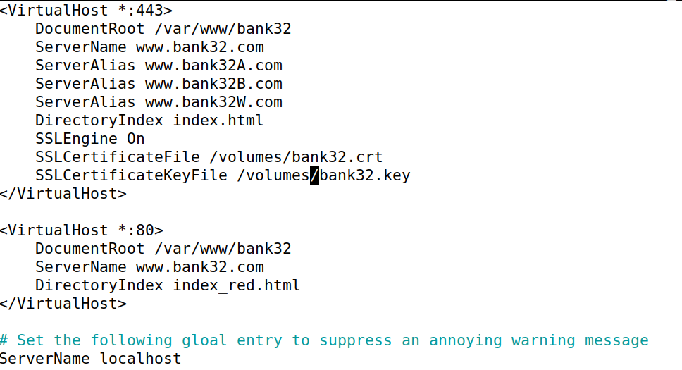

Como o diretório `volumes` é partilhado pela VM e pelo container, basta copiarmos os ficheiros `bank32.crt` e `bank32.key` para lá.

De seguida, começamos o servidor Apache:

```
# service apache2 start
```

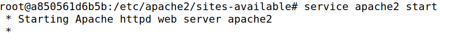


Deste modo, ao acedermos ao site https://bank32.com, verificamos que a ligação era insegura:

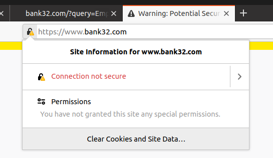

Para resolver este problema, era necessário dar load do nosso certificado no browser, através de `about:preferences#privacy -> Certificates -> View Certificates -> Authorities -> Import`:

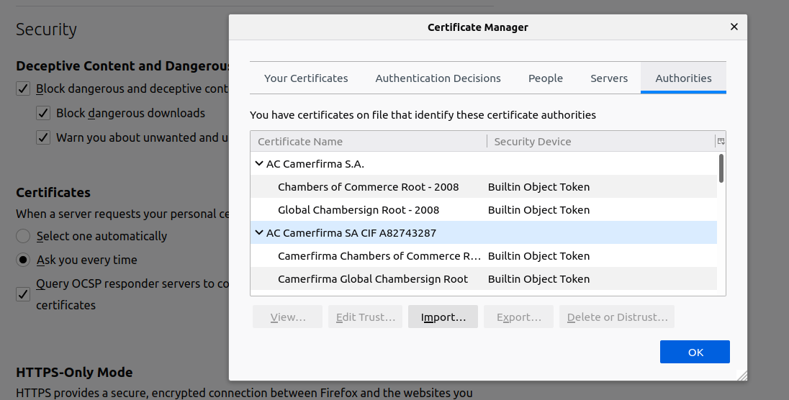


Ao acedermos novamente ao site, a ligação passou a ser segura:

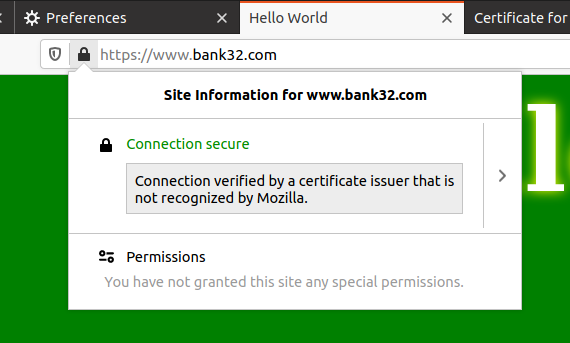


## Task 5: Launching a Man-In-The-Middle Attack

Para lançar um `Man-In-The-Middle Attack` no site `www.example.com`:

- modificamos o ficheiro `/etc/apache2/bank32 apache ssl.conf` para:

```xml
<VirtualHost *:443> 
    DocumentRoot /var/www/bank32
    ServerName www.example.com
    ServerAlias www.bank32A.com
    ServerAlias www.bank32B.com
    ServerAlias www.bank32W.com
    DirectoryIndex index.html
    SSLEngine On 
    SSLCertificateFile /volumes/bank32.crt
    SSLCertificateKeyFile /volumes/bank32.key
</VirtualHost>
```

- adicionamos o hostname `www.example.com` ao nosso DNS:

```
sudo nano etc/hosts     # adicionar '10.9.0.80 www.example.com'
```


Ao aceder ao site `www.example.com`, o browser alerta-nos para potenciais riscos, o que se deve à incoerência do certificado usado, isto é, o nome de dominio não coincide com aquele presente no certificado do servidor.

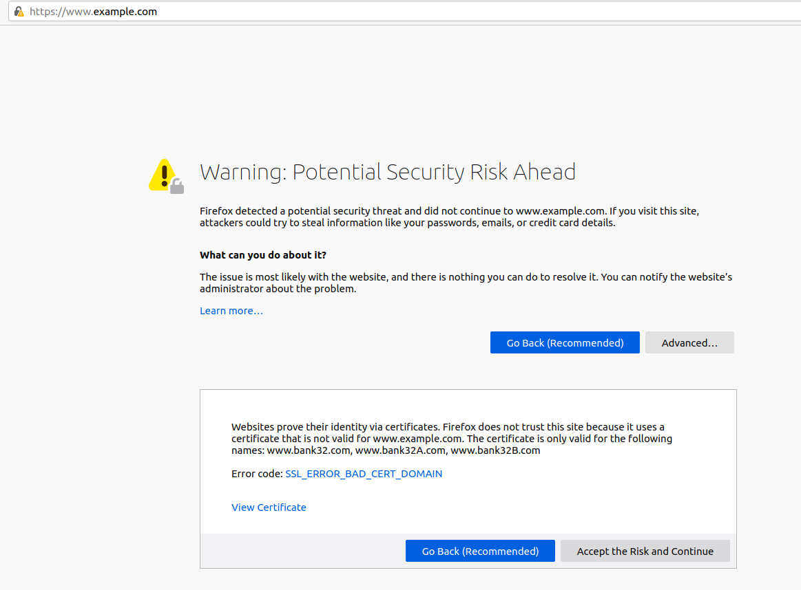


## Task 6: Launching a Man-In-The-Middle Attack with a Compromised CA

Partindo do princípio que o nosso CA está comprometido, pode-se lançar um `Man-In-The-Middle Attack` gerando certificados para sites maliciosos. Assim sendo, repetimos a `task 2`, mas criando um certificando para o website `www.example.com`.

Com os ficheiros `example.csr` e `example.key` criados, modificamos o ficheiro de configuração do servidor `/etc/apache2/sites-available/bank32_apache_ssl.conf` para:

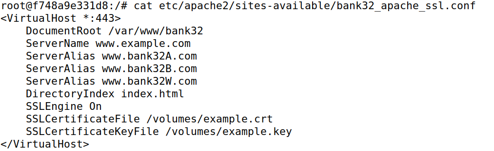

Desta vez, ao acedermos a `www.example.com`, o browser não alerta para nenhum risco de navegação:

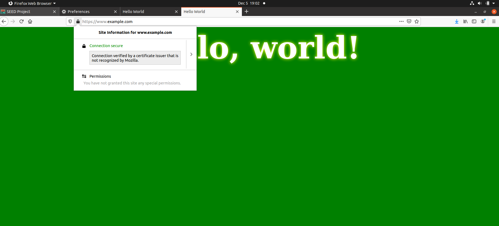


