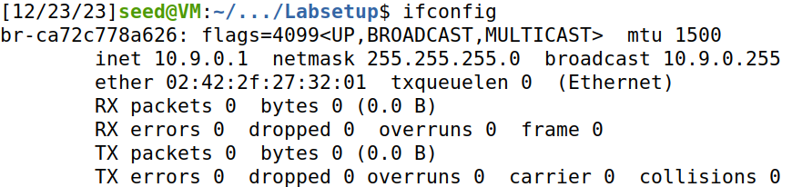
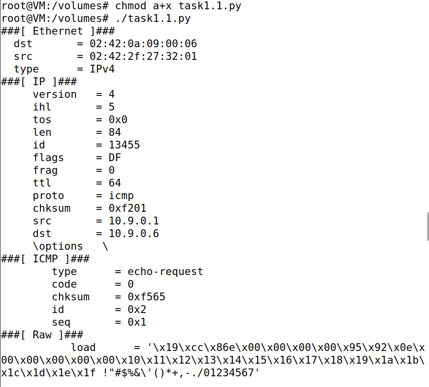
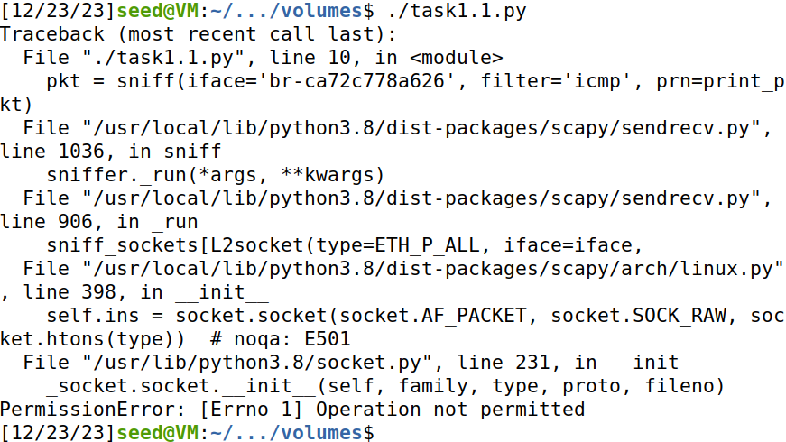

# Trabalho realizado na Semana #11

## Lab Setup

### Overview

Neste lab, o foco incide sobre "sniffing" e "spoofing", aspetos essenciais da segurança de redes com implicações significativas na comunicação em rede. 

| Sniffing      | Spoofing |
| ----------- | ----------- |
| Refere-se à prática de intercetar e analisar o tráfego de dados em uma rede para obter informações, podendo ser usada para fins de monitoramento legítimo ou para atividades maliciosas.      | Envolve a falsificação de identidade, onde um dispositivo ou usuário mascara sua identidade real, podendo ser utilizado para enganar sistemas de segurança, realizar ataques de phishing ou manipular informações dentro de uma rede.       |


### Setup

Neste laboratório, foram utilizadas três máquinas ligadas à mesma LAN. 
Todos os ataques foram realizados na máquina do atacante, enquanto as outras máquinas serviam como máquinas de utilizadores. 

A configuração dos contentores acima descritos envolveu o download e descompactação do ficheiro Labsetup.zip, mais concretamente o ficheiro docker-compose.yml para estabelecer o ambiente do laboratório. 

De seguida, foi-nos pedido que utilizassemos o comando "docker ps" para descobrir o ID do contentor, seguido do comando "docker exec" para iniciar uma shell nesse contentor.

Neste laboratório, a máquina do atacante pode ser tanto uma VM quanto um contentor de atacante, conforme especificado no ficheiro Docker Compose. 

O contentor de atacante é configurado de forma diferente, apresentando uma pasta partilhada para uma edição de código conveniente e um modo de anfitrião para permitir a interceção de pacotes. 

O endereço IP atribuído à network é 10.9.0.1, e o ID da redeé 10.9.0.0/24. Foi-nos pedido ainda que encontrássemos o nome da interface de rede da nossa VM. Como podemos observar abaixo, no nosso caso: **br-ca72c778a626**.




## Task 1.1: Sniffing Packets

O objetivo da tarefa era familiarizar-nos com o uso do Scapy em programas Python para interceção de pacotes (sniffing). Foi fornecido um código de exemplo para esse efeito. 

A estrutura do código inclui a importação do Scapy, a definição de uma função para exibir detalhes do pacote e o uso da função 'sniff' com parâmetros específicos de interface e filtro:

```python
pkt = sniff(iface='br-ca72c778a626', filter='icmp', prn=print_pkt)
```

### Task 1.1 A

Com root privilege:



Sem root privilege:



### Task 1.1 B

De seguida, foi-nos pedido que alterassemos o script de python, para que capturasse packets apenas de um determinado tipo.

**1. Capturar apenas o pacote ICMP**

```python
#!/usr/bin/env python3
from scapy.all import *
def print_pkt(pkt):
  pkt.show()
pkt = sniff(iface='br-ca72c778a626', filter='icmp', prn=print_pkt)  
```

**2. Capturar qualquer pacote TCP proveniente de um IP específico e com um número de porta de destino 23**

```python
#!/usr/bin/env python3
from scapy.all import *
def print_pkt(pkt):
  pkt.show()
pkt = sniff(iface='br-ca72c778a626', filter='tcp && src host 10.9.0.6 && dst port 23', prn=print_pkt) 
```

**3. Capturar pacotes provenientes ou destinados a uma sub-rede específica. (Qualquer sub-rede, como 128.230.0.0/16, mas não a sub-rede à qual a VM está conectada)**

```python
#!/usr/bin/env python3
from scapy.all import *
def print_pkt(pkt):
  pkt.show()
pkt = sniff(iface='br-ca72c778a626', filter='128.230.0.0/16', prn=print_pkt)  
```

## Task 1.2: Spoofing ICMP Packets

1. 


## Task 1.3: Traceroute


## Task 1.4: Sniffing and-then Spoofing
