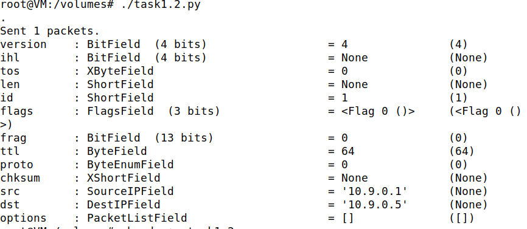
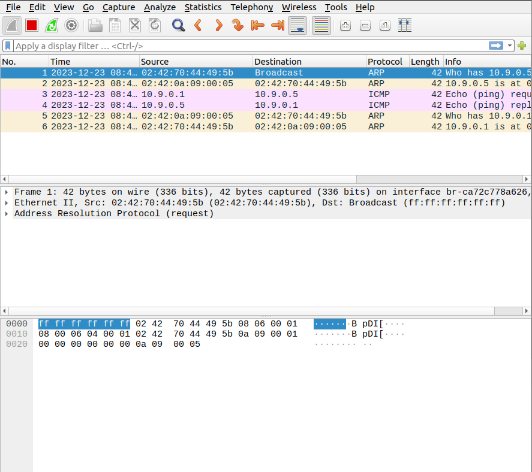
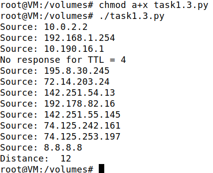
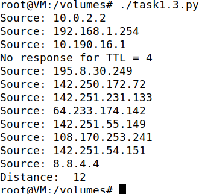
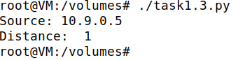
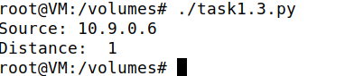
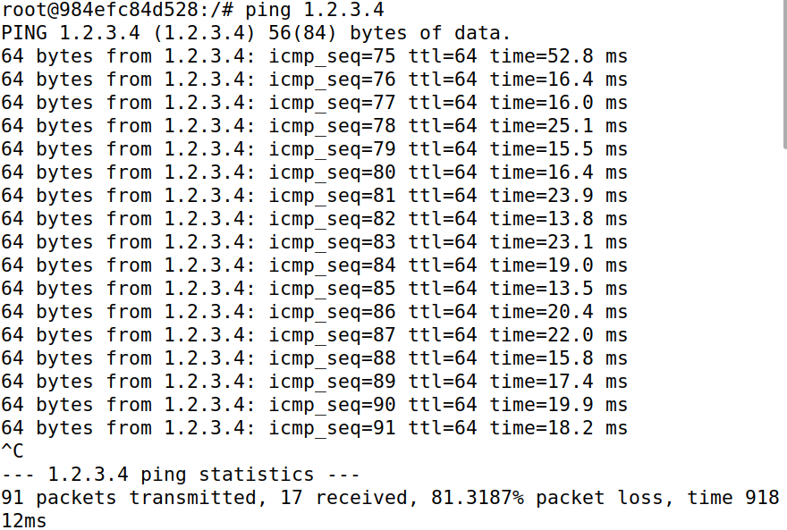
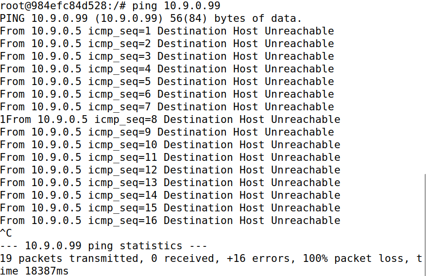
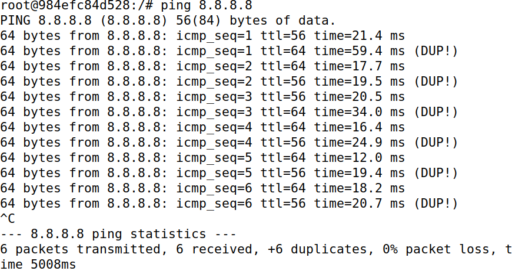

# Trabalho realizado na Semana #13

### Overview

Neste lab, o foco incide sobre "sniffing" e "spoofing", aspetos essenciais da segurança de redes com implicações significativas na comunicação em rede. 

| Sniffing      | Spoofing |
| ----------- | ----------- |
| Refere-se à prática de intercetar e analisar o tráfego de dados em uma rede para obter informações, podendo ser usada para fins de monitoramento legítimo ou para atividades maliciosas.      | Envolve a falsificação de identidade, onde um dispositivo ou usuário mascara a sua identidade real, podendo ser utilizado para enganar sistemas de segurança, realizar ataques de phishing ou manipular informações dentro de uma rede.       |


### Setup

Neste laboratório, foram utilizadas três máquinas ligadas à mesma LAN. 
Todos os ataques foram realizados na máquina do atacante, enquanto as outras máquinas serviam como máquinas de utilizadores. 

A configuração dos contentores acima descritos envolveu o download e descompactação do ficheiro Labsetup.zip, mais concretamente o ficheiro docker-compose.yml para estabelecer o ambiente do laboratório. 

De seguida, foi-nos pedido que utilizassemos o comando "docker ps" para descobrir o ID do contentor, seguido do comando "docker exec" para iniciar uma shell nesse contentor.

O contentor de atacante é configurado de forma diferente, apresentando uma pasta partilhada para uma edição de código conveniente e um modo de anfitrião para permitir a interceção de pacotes. 

O endereço IP atribuído à network é 10.9.0.1, e o ID da rede é 10.9.0.0/24. Foi-nos pedido ainda que encontrássemos o nome da interface de rede da nossa VM. Como podemos observar abaixo, no nosso caso: **br-ca72c778a626**.


## Task 1.1: Sniffing Packets

O objetivo da tarefa era familiarizar-nos com o uso do Scapy em programas Python para interceção de pacotes (sniffing). Foi fornecido um código de exemplo para esse efeito. 

A estrutura do código inclui a importação do Scapy, a definição de uma função para exibir detalhes do pacote e o uso da função 'sniff' com parâmetros específicos de interface e filtro:

```python
pkt = sniff(iface='br-ca72c778a626', filter='icmp', prn=print_pkt)
```

### Task 1.1 A

Com root privilege:


Sem root privilege:


### Task 1.1 B

De seguida, foi-nos pedido que alterássemos o script em Python para que capturasse pacotes apenas de um determinado tipo.

**1. Capturar apenas o pacote ICMP**

```python
#!/usr/bin/env python3
from scapy.all import *
def print_pkt(pkt):
  pkt.show()
pkt = sniff(iface='br-ca72c778a626', filter='icmp', prn=print_pkt)  
```

**2. Capturar qualquer pacote TCP proveniente de um IP específico e com um número de porta de destino 23**

```python
#!/usr/bin/env python3
from scapy.all import *
def print_pkt(pkt):
  pkt.show()
pkt = sniff(iface='br-ca72c778a626', filter='tcp && src host 10.9.0.6 && dst port 23', prn=print_pkt) 
```

**3. Capturar pacotes provenientes ou destinados a uma sub-rede específica. (Qualquer sub-rede, como 128.230.0.0/16, mas não a sub-rede à qual a VM está conectada)**

```python
#!/usr/bin/env python3
from scapy.all import *
def print_pkt(pkt):
  pkt.show()
pkt = sniff(iface='br-ca72c778a626', filter='128.230.0.0/16', prn=print_pkt)  
```

## Task 1.2: Spoofing ICMP Packets


Através da aplicação da ferramenta de manipulação de pacotes, Scapy, conseguimos ajustar os parâmetros dos pacotes IP conforme necessário. 

O propósito central desta atividade consistiu em criar pacotes IP falsificados com um endereço IP de origem arbitrário. Esses pacotes, que simulavam solicitações de eco ICMP, foram então direcionados a outra máquina virtual na mesma rede. 

A utilização do Wireshark possibilitou a observação quanto à aceitação da solicitação pelo destinatário. Caso fosse aceite, um pacote de resposta de eco seria encaminhado para o endereço IP falsificado. 

A implementação dessa tarefa envolveu a execução do seguinte código:

```python
#!/usr/bin/env python3
from scapy.all import *
a = IP()
a.src = '10.9.0.1'
a.dst = '10.9.0.5'
b = ICMP()
p = a/b
send(p)
```

Ao indicarmos o endereço IP de um dos nossos contentores ('10.9.0.5') e ao gerarmos um pacote ICMP, fomos capazes de enviar esse pacote para o contentor que escolhemos (neste caso o contentor do host A).



Assim, podemos ver no WireShark:




## Task 1.3: Traceroute

Nesta tarefa, utilizamos o Scapy para estimar a distância, em termos de número de routers, entre máquina virtual (VM) e um destino selecionado. 

O objetivo era criar uma ferramenta semelhante ao traceroute. O processo consistiu em enviar um pacote (de qualquer tipo) para o destino com o campo Time-To-Live (TTL) inicialmente definido como 1. 

O primeiro router descartou o pacote, enviando-nos uma mensagem de erro ICMP indicando que o tempo de vida tinha sido excedido, revelando assim o endereço IP do primeiro router. 

Esse procedimento foi repetido aumentando gradualmente o valor do TTL até que o pacote finalmente atingisse o destino. 

No final, obtemos o seguint script:

```python
#!/usr/bin/env python3
from scapy.all import *

for i in range(1, 30):
	a = IP()
	a.dst = '8.8.8.8'
	a.ttl = i
	b = ICMP()
	a_response = sr1(a/b, timeout=1, verbose=0)
	
	if a_response is not None:
		print("Source:", a_response.src)
		if a_response.src == '8.8.8.8':
			print("Distance: ", a.ttl)
			break  
	else:
		print("No response for TTL =", i)
	time.sleep(1)
```

E aqui está o resultado de alguns testes para diferentes destinos:

| '8.8.8.8' | '8.8.4.4' | '10.9.0.5' | '10.9.0.6' | 
| ----------- | ----------- | ----------- | ----------- |
|       |       |       |       |


## Task 1.4: Sniffing and-then Spoofing


Nesta tarefa, combinamos as técnicas de "sniffing" e "spoofing" para criar um programa de "sniff-and-then-spoof". 

Para isso, tal como sugerido no enunciado, utilizamos duas máquinas na mesma LAN: a VM e o contentor de utilizador. A partir do contentor de utilizador, fizemos um ping para um IP X, gerando um pedido de eco ICMP.

Quando X está ativo, o programa ping recebe uma resposta de eco e imprime a resposta. O programa "sniff-and-then-spoof" é executado na VM, monitorando a LAN através de "sniffing" de pacotes. 

Sempre que deteta um pedido de eco ICMP, independentemente do endereço IP de destino, o programa envia imediatamente uma resposta de eco utilizando a técnica de "spoofing" de pacotes. 

Assim, o programa ping sempre recebe uma resposta, indicando que X está ativo, independentemente da sua disponibilidade real.

O script final que obtermos foi o seguinte:

```python
#!/usr/bin/env python3
from scapy.all import *

def spoof(pkt):
	if pkt[ICMP].type == 8:
        	src = pkt[IP].src
        	dst = pkt[IP].dst
        	
        	print("Original Packet")
        	print("Source: ", src)
        	print("Destination:", dst)
        	
        	ihl = pkt[IP].ihl
        	ip = IP(src=dst, dst=src, ihl=ihl)
        	icmp = ICMP(type=0, id=pkt[ICMP].id, seq=pkt[ICMP].seq)
        	data = pkt[Raw].load
        	newpacket = ip/icmp/data
        	
        	print("Spoofed Packet")
        	print("Source: ", newpacket[IP].src)
        	print("Destination: ", newpacket[IP].dst)
        	
        	send(newpacket, verbose=0)


pkt = sniff(iface='br-ca72c778a626', filter='icmp and host 1.2.3.4', prn=spoof)
```

| '1.2.3.4' | '10.9.0.99' | '8.8.8.8' | 
| ----------- | ----------- | ----------- |
|       |       |       |
| O pacote original é enviado do contentor de utilizador para o host inexistente 1.2.3.4 na Internet. De seguida, o programa deteta o pacote de pedido de eco ICMP e falsifica um pacote de resposta, indicando que o host inexistente (1.2.3.4) está ativo. O programa ping no contentor de utilizador recebe uma resposta, sugerindo falsamente que o host inexistente está acessível. | Neste caso, como o host inexistente está na mesma rede local, os pacotes não necessariamente precisam passar pelo computador do atacante. Quando um host deseja comunicar com outro host na mesma rede local, ele envia um pedido ARP para descobrir o endereço MAC associado ao endereço IP. Neste caso, o pacote de difusão é enviado para toda a rede local, e não envolve o endereço MAC do atacante. | O pacote original é enviado do contentor de utilizador para o host existente 8.8.8.8 na Internet. O programa deteta o pacote de pedido de eco ICMP e indica que o host existente (8.8.8.8) está ativo. O programa ping no contentor de utilizador recebe uma resposta, mas, neste caso, a resposta é legítima, refletindo o estado real do host. |
